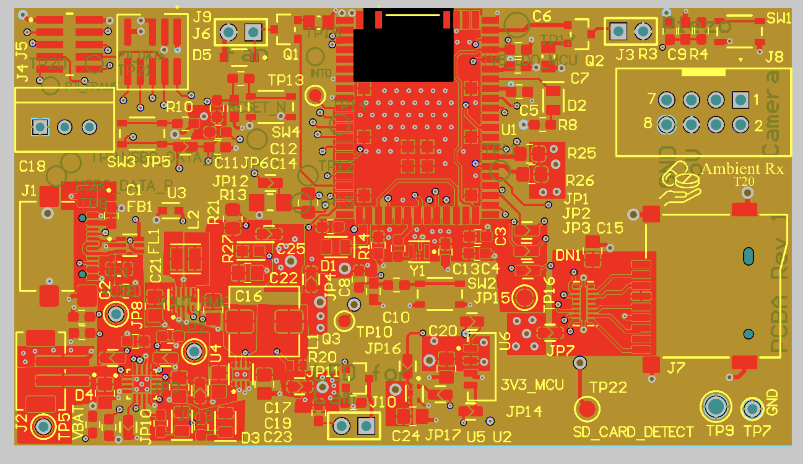
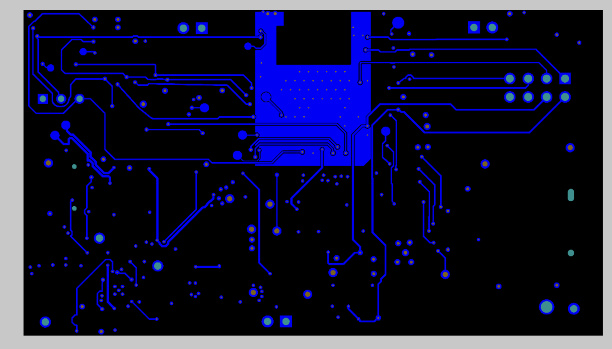
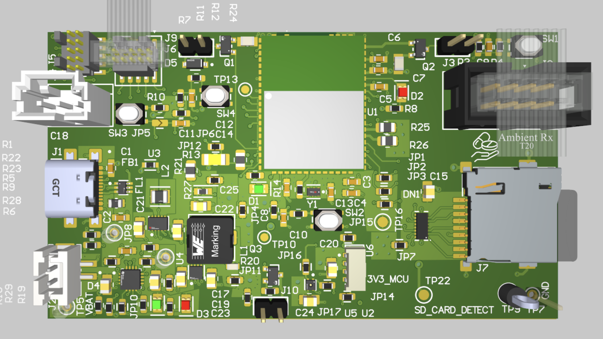

<div align="center">

# Ambient Medication Storage Box

**Custom PCB. RTOS firmware. Cloud-connected. 60 mm × 60 mm.**

A battery-powered smart storage system that monitors and regulates temperature for heat-sensitive medications, with real-time cloud telemetry.

[](https://www.altium.com/)
[](https://www.arm.com/)
[](https://www.freertos.org/)
[]()

<!-- Replace with your actual board photo -->
<!--  -->

</div>

---

## Why This Exists

Insulin, biologics, and certain antibiotics degrade outside narrow temperature windows. Most people store them in kitchen cabinets with zero monitoring. One heatwave and hundreds of dollars of medication are gone. This project is a compact, connected box that watches the temperature, cools when needed, and yells at you over Wi-Fi if something goes wrong.

---

## What It Does

- Continuously monitors temperature and humidity (Sensirion SHT45, I2C)
- Actively regulates temperature with a PWM-driven fan
- Pushes readings to the cloud over Wi-Fi with sub-100 ms latency
- Runs on LiPo with USB charging and seamless power-path switching (BQ24075)
- Sends alerts when conditions drift outside safe thresholds

---

## Hardware

### Custom 4-Layer PCB

Designed end-to-end in **Altium Designer** - schematic capture, placement, routing, Gerber/BOM/CPL generation, component sourcing from DigiKey and Mouser, shipped to fab.

```
┌──────────────────────────────────┐
│          60mm × 60mm             │
│                                  │
│   Layer 1: Signal (Top)          │
│   Layer 2: GND Plane             │
│   Layer 3: Power Plane           │
│   Layer 4: Signal (Bottom)       │
└──────────────────────────────────┘
```

| Top Layer | Bottom Layer | 3D Render |
|:---------:|:-----------:|:---------:|
| ) |  |  |

### Design Highlights

<details>
<summary><b>Power path (BQ24075)</b></summary>
<br>

The BQ24075 handles single-cell LiPo charging from USB with automatic power-path selection. When USB is plugged in, the system runs directly from USB while trickle-charging the battery. Yank the cable — zero dropout, no reset, no data loss. The switchover is completely seamless.

Input current limiting is set via a single external resistor to stay within USB 500 mA specs. Charge status is monitored via GPIO interrupt, not polling.

</details>

<details>
<summary><b>Mixed-signal routing on a tiny board</b></summary>
<br>

60 mm × 60 mm with both a Wi-Fi radio and precision analog sensors. Analog traces (SHT45 I2C, ADC lines) are routed on the opposite side of the board from the SiWG917 RF antenna and digital buses, with a continuous ground plane providing isolation.

Result: clean sensor readings even with Wi-Fi transmitting on the same PCB.

</details>

<details>
<summary><b>Thermal management</b></summary>
<br>

Copper pours on inner layers spread heat under the SoC and voltage regulators. Component spacing around the BQ24075 and power inductors was tuned to prevent hotspots, validated with bench measurements.

</details>

---

## Firmware

RTOS-based C/C++ on the **SiWG917 ARM Cortex** wireless SoC.

```
                    ┌─────────────────────┐
                    │     FreeRTOS        │
                    │   Task Scheduler    │
                    └────────┬────────────┘
                             │
            ┌────────────────┼────────────────┐
            │                │                │
     ┌──────▼──────┐  ┌─────▼─────┐  ┌──────▼──────┐
     │  Sensor Task │  │  Fan Ctrl  │  │ Wi-Fi Telem │
     │  (SHT45)    │  │  (PWM)     │  │ (Cloud Push) │
     └──────┬──────┘  └─────┬─────┘  └──────┬──────┘
            │                │                │
     ┌──────▼──────┐  ┌─────▼─────┐  ┌──────▼──────┐
     │    I2C      │  │   Timer   │  │   TCP/IP    │
     │   Driver    │  │   PWM HW  │  │   Stack     │
     └─────────────┘  └───────────┘  └─────────────┘
```

### Peripherals

| Peripheral | Interface | Function |
|:-----------|:----------|:---------|
| Sensirion SHT45 | I2C | Temperature + humidity sensing |
| Camera module | SPI | Visual monitoring of storage interior |
| Cooling fan | PWM | Active temp regulation, duty-cycle controlled |
| BQ24075 | ADC + GPIO | Battery voltage, charge status interrupts |
| Status LEDs | GPIO | Condition alerts |
| Wi-Fi | On-chip | Cloud telemetry + push notifications |

### Firmware Architecture

- **Interrupt-driven ADC** for battery monitoring — no polling
- **Priority-based scheduling** — sensor reads never block telemetry
- **Event-driven GPIO** — charge status changes trigger ISR
- **Sub-100 ms** sensor-to-cloud latency

---

## Repo Structure

```
ambient-medication-storage/
├── README.md
├── hardware/
│   ├── schematic/          # Altium exports (PDF, PNG)
│   ├── layout/             # Layer screenshots, 3D renders
│   ├── gerbers/            # Manufacturing-ready Gerbers
│   └── bom/                # BOM + CPL
├── firmware/
│   ├── src/                # Application code (C/C++)
│   ├── drivers/            # SHT45, fan, BQ24075 drivers
│   └── config/             # FreeRTOS config, pin maps
└── docs/
    ├── block-diagram.png
    └── 3d-render.png
```

---

## Tech Stack

| | |
|:---------|:------|
| PCB | Altium Designer |
| MCU | Silicon Labs SiWG917 (ARM Cortex + Wi-Fi) |
| RTOS | FreeRTOS |
| Languages | C |
| Power | TI BQ24075 |
| Sensor | Sensirion SHT45 |
| Sourcing | DigiKey, Mouser |

---

## Course

ESE5160 - IoT Edge Computing, University of Pennsylvania

---

<div align="center">

**Ananya Shivarama Bhat**

M.S.E. Electrical & Systems Engineering, University of Pennsylvania

[Portfolio](https://ananyabhat.framer.website/) · [LinkedIn](https://www.linkedin.com/in/ananya473/) · [Email](mailto:ananya9@seas.upenn.edu)

</div>
