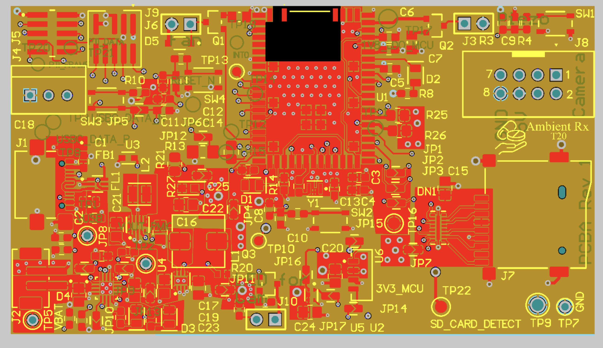
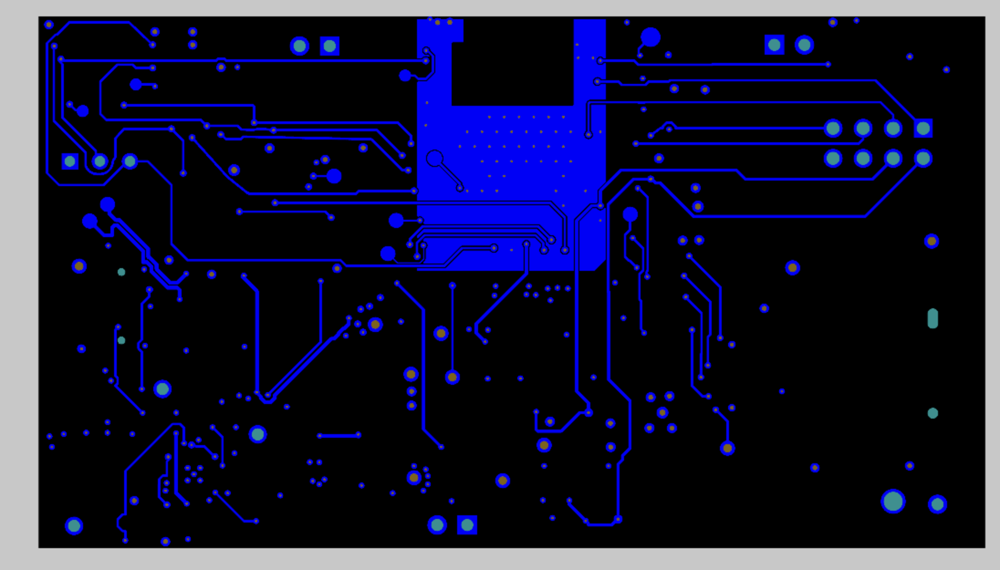
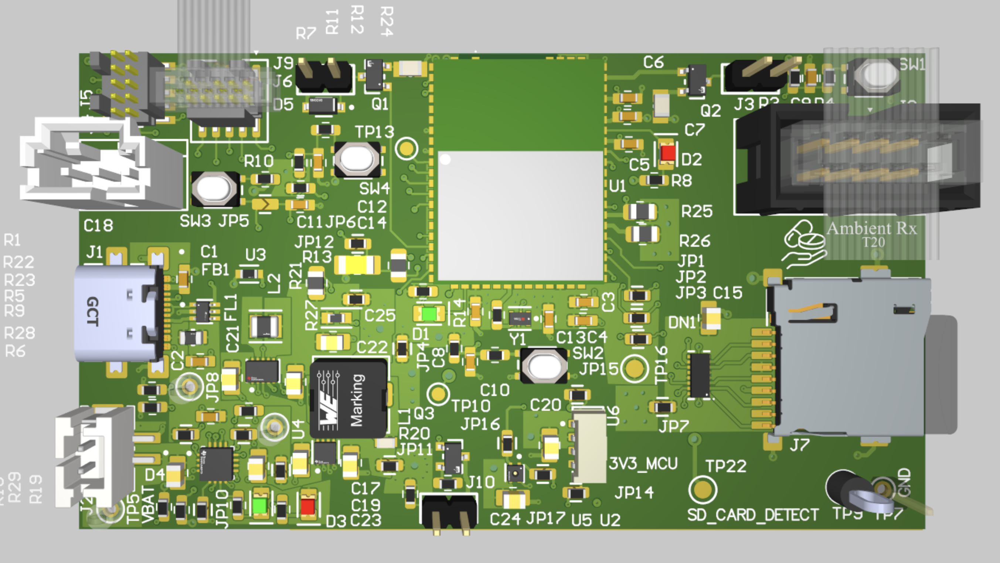
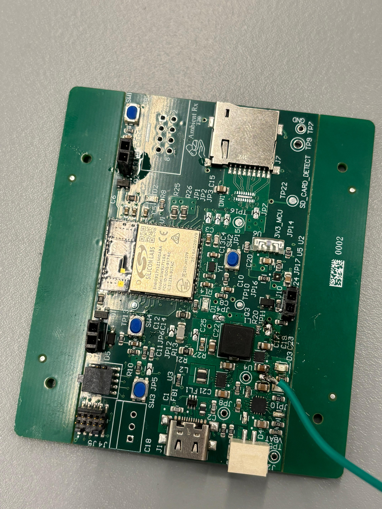
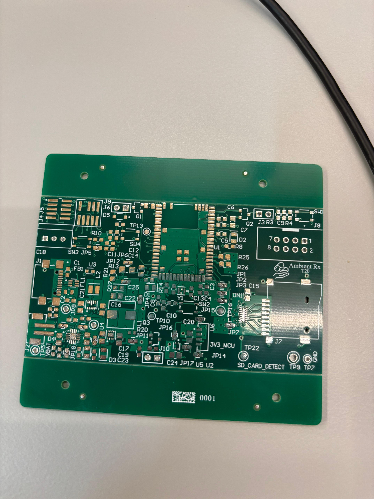
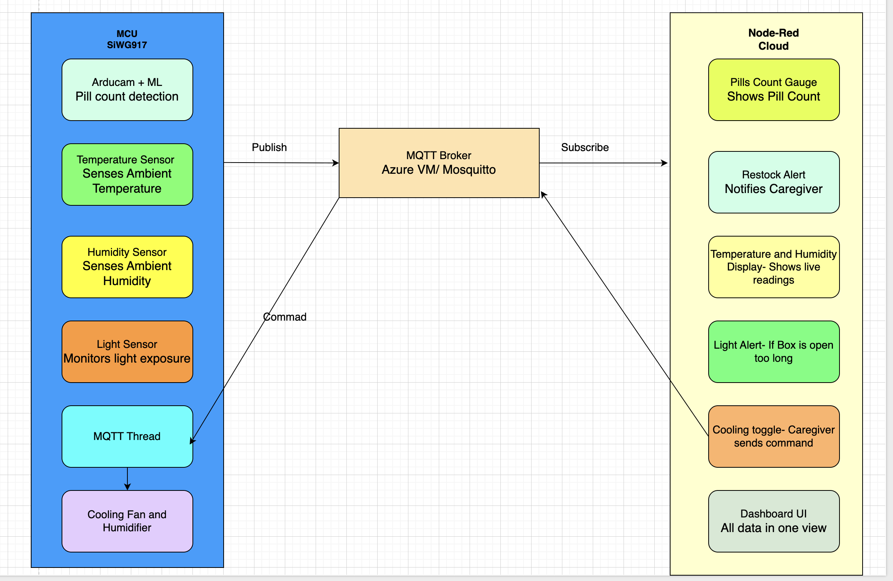
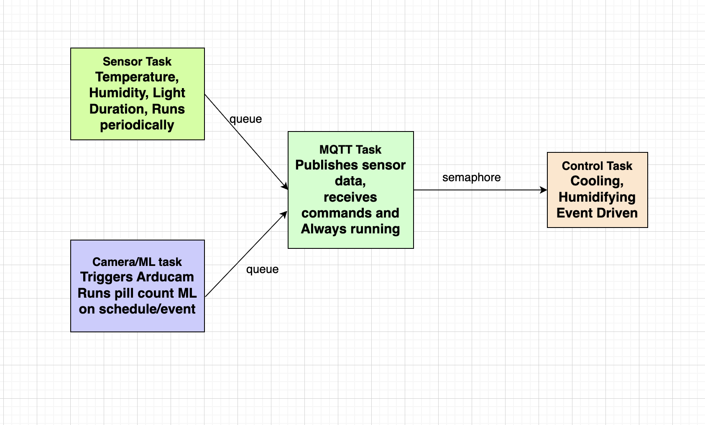

<div align="center">

# AmbientRx — Ambient Medication Storage Box

**Custom PCB. RTOS firmware. Cloud-connected. 60 mm × 60 mm.**

A battery-powered smart medication storage system that monitors pill count, regulates temperature, and alerts caregivers in real time over Wi-Fi.

[](https://www.altium.com/)
[](https://www.arm.com/)
[](https://www.freertos.org/)
[]()
[]()

| Top Layer | Bottom Layer | 3D Render |
|:---------:|:-----------:|:---------:|
|  |  |  |


</div>

<div align="center">

| Board | Stencil |
|:-----:|:-------:|
|  |  |

</div>
---

## Why This Exists

<p align="justify">
Insulin, biologics, and certain antibiotics degrade outside narrow temperature windows. Most people store them in kitchen cabinets with zero monitoring. One heatwave and hundreds of dollars of medication are gone. Beyond temperature, caregivers have no visibility into whether a patient has taken their medication or whether the supply needs restocking. AmbientRx solves both problems in a compact, connected box that watches temperature, counts pills with a camera and ML model, and alerts caregivers over Wi-Fi when something needs attention.
</p>

---

## What It Does

- Continuously monitors **temperature and humidity** (Sensirion SHT45, I2C)
- **Counts remaining pills** using ArduCam image capture and onboard ML inference
- Actively **regulates temperature** with a PWM-driven cooling fan
- Pushes all readings to the **cloud over MQTT** with sub-100 ms latency
- Runs on **LiPo** with USB charging and seamless power-path switching (BQ24075)
- Fires **caregiver alerts** when pill count is low, temperature is high, humidity spikes, or light has been on too long
- Accepts **remote commands** from a Node-RED dashboard to activate cooling

---

## Hardware

### Custom 4-Layer PCB

<p align="justify">
Designed end-to-end in Altium Designer — schematic capture, placement, routing, Gerber/BOM/CPL generation, component sourcing from DigiKey and Mouser, shipped to fab. The board fits entirely within a 60 mm x 60 mm footprint while housing a Wi-Fi SoC, precision analog sensors, a camera interface, power management, and a fan driver.
</p>
### Peripherals

| Peripheral | Interface | Function |
|:-----------|:----------|:---------|
| Sensirion SHT45 | I2C | Temperature and humidity sensing |
| ArduCam | SPI | Captures images of pill compartment |
| Cooling fan | PWM | Active temperature regulation, duty-cycle controlled |
| BQ24075 | ADC + GPIO | Battery voltage, charge status interrupts |
| Status LEDs | GPIO | Condition alerts |
| Wi-Fi | On-chip | Cloud telemetry and MQTT communication |

### Design Highlights

<details>
<summary><b>Power path (BQ24075)</b></summary>
<br>
<p align="justify">
The BQ24075 handles single-cell LiPo charging from USB with automatic power-path selection. When USB is plugged in, the system runs directly from USB while trickle-charging the battery. Disconnect the cable and there is zero dropout, no reset, and no data loss. Input current limiting is set via a single external resistor to stay within USB 500 mA specs. Charge status is monitored via GPIO interrupt, not polling.
</p>
</details>

<details>
<summary><b>Mixed-signal routing on a tiny board</b></summary>
<br>
<p align="justify">
60 mm x 60 mm with both a Wi-Fi radio and precision analog sensors. Analog traces (SHT45 I2C, ADC lines) are routed on the opposite side of the board from the SiWG917 RF antenna and digital buses, with a continuous ground plane providing isolation. Result: clean sensor readings even with Wi-Fi transmitting on the same PCB.
</p>
</details>

<details>
<summary><b>Thermal management</b></summary>
<br>
<p align="justify">
Copper pours on inner layers spread heat under the SoC and voltage regulators. Component spacing around the BQ24075 and power inductors was tuned to prevent hotspots, validated with bench measurements.
</p>
</details>

---
---

## Board Bring-Up

<p align="justify">
After receiving the fabricated PCB, the board was brought up systematically — starting with power rails, then verifying each peripheral in isolation before integrating the full firmware stack.
</p>

### Power Rail Verification

<p align="justify">
The first step was confirming all voltage rails were within spec before powering any peripherals. The 3.3 V and 1.8 V rails were probed with a multimeter and oscilloscope to check for noise, ripple, and correct voltage levels. The BQ24075 power path was verified by toggling between USB and battery input and confirming seamless switchover with no dropout.
</p>

<!-- Add oscilloscope screenshots of power rails here -->
<!--  -->

### Programming and Debug

<p align="justify">
The SiWG917 was flashed over SWD using a J-Link debugger. Initial bring-up firmware verified the clock configuration, GPIO toggling, and UART debug output before any peripherals were enabled.
</p>

<!-- Add debugger setup photo here -->
<!--  -->

### Peripheral Verification

Each peripheral was tested in isolation with minimal firmware before full integration:

| Peripheral | Test | Result |
|:-----------|:-----|:-------|
| Sensirion SHT45 | I2C scan, read temp/humidity over serial | |
| ArduCam | SPI loopback, capture test image | |
| Cooling fan | PWM sweep 0-100% duty cycle | |
| BQ24075 | USB charge, battery switchover | |
| Status LEDs | GPIO toggle all channels | |
| Wi-Fi | Scan networks, connect to AP | |

<!-- Add bench testing photos here -->
<!--  -->

### Assembled Board

<!-- Add photo of fully assembled board here -->
<!--  -->

---
## Firmware

<p align="justify">
RTOS-based C firmware runs on the SiWG917 ARM Cortex wireless SoC. The application is divided into four independent FreeRTOS tasks that communicate via queues and semaphores, ensuring no single operation blocks the system.
</p>

### Software Block Diagram

```
                    ┌─────────────────────┐
                    │     FreeRTOS        │
                    │   Task Scheduler    │
                    └────────┬────────────┘
                             │
          ┌──────────────────┼──────────────────┐
          │                  │                  │
   ┌──────▼───────┐  ┌──────▼───────┐  ┌──────▼───────┐
   │ Sensor Task  │  │ Camera/ML    │  │  MQTT Task   │
   │ Temp/Humid   │  │ Pill Count   │  │  Pub/Sub     │
   │ Light        │  │ ArduCam+ML   │  │  Wi-Fi Conn  │
   └──────┬───────┘  └──────┬───────┘  └──────┬───────┘
          │                  │                  │
          └────────┬─────────┘                  │
               FreeRTOS Queue          ┌────────▼───────┐
                   │                   │  Control Task  │
                   └───────────────────►  Cooling Fan   │
                                       │  Event-driven  │
                                       └────────────────┘
```

### Task Breakdown

| Task | Trigger | Responsibility |
|:-----|:--------|:---------------|
| Sensor task | Periodic timer | Reads temp/humidity/light, checks thresholds, pushes to queue |
| Camera/ML task | Schedule or event | Triggers ArduCam, runs ML inference, pushes pill count to queue |
| MQTT task | Always running | Reads queues, publishes to broker, receives and forwards commands |
| Control task | Semaphore/event | Receives cooling command, drives fan PWM accordingly |

### Firmware Architecture

- **Interrupt-driven ADC** for battery monitoring — no polling
- **Priority-based scheduling** — sensor reads never block telemetry
- **Event-driven GPIO** — charge status changes trigger ISR
- **Sub-100 ms** sensor-to-cloud latency

---

## Cloud Communication

<p align="justify">
AmbientRx uses MQTT over Wi-Fi to create a bidirectional communication channel between the device and the caregiver-facing Node-RED dashboard, both hosted on a Microsoft Azure virtual machine running a Mosquitto MQTT broker.
</p>

### How It Works

<p align="justify">
The MCU sensor and camera tasks continuously collect data and push it into FreeRTOS queues. The MQTT task drains these queues and publishes each reading to its corresponding topic on the broker. Node-RED subscribes to all sensor topics, displays live values on the dashboard, and evaluates threshold conditions. When a condition is breached — low pill count, high temperature, high humidity, or light left on too long — Node-RED generates an alert and surfaces it to the caregiver through the UI. The caregiver can respond by toggling the cooling switch on the dashboard, which causes Node-RED to publish a command to the cooling control topic. The MCU MQTT task receives this and signals the control task via semaphore, which then drives the fan accordingly.
</p>

### System Flow


<p align="center">Figure 1: End-to-end system communication flow</p>

### MQTT Thread Flow


<p align="center">Figure 2: MQTT task internal state flow</p>

### MQTT Topic Table

| Topic | Data Type | Publisher | Subscriber | Description |
|:------|:----------|:----------|:-----------|:------------|
| `ambrx/pills/count` | Integer | MCU | Node-RED | Pills remaining in compartment |
| `ambrx/pills/restock` | Boolean | Node-RED | Caregiver UI | Low pill alert |
| `ambrx/temperature` | Float (°C) | MCU | Node-RED | Ambient box temperature |
| `ambrx/humidity` | Float (%) | MCU | Node-RED | Ambient humidity level |
| `ambrx/light/alert` | Boolean | MCU | Node-RED | Light on too long |
| `ambrx/cooling/control` | Boolean | Node-RED | MCU | Activate or deactivate cooling |

### Node-RED Dashboard

<p align="justify">
The Node-RED UI gives the caregiver a single view of all device telemetry. Live gauges show temperature and humidity readings. A pill count indicator changes colour as stock runs low. Alert banners fire when thresholds are crossed. A toggle switch lets the caregiver activate remote cooling directly from the browser with no app install required.
</p>

---

## Repo Structure
```
ambient-medication-storage/
├── README.md
├── hardware/
│   ├── schematic/          # Altium exports (PDF, PNG)
│   ├── layout/             # Layer screenshots, 3D renders
│   ├── gerbers/            # Manufacturing-ready Gerbers
│   └── bom/                # BOM + CPL
├── firmware/
│   ├── src/                # Application code (C)
│   ├── drivers/            # SHT45, ArduCam, fan, BQ24075 drivers
│   └── config/             # FreeRTOS config, pin maps
├── node-red/
│   └── flows.json          # Node-RED dashboard source
└── docs/
├── cloud-flow.png
├── mqtt-flow.png
└── block-diagram.png

```
---

## Tech Stack

| | |
|:---------|:------|
| PCB | Altium Designer |
| MCU | Silicon Labs SiWG917 (ARM Cortex + Wi-Fi) |
| RTOS | FreeRTOS |
| Language | C |
| Cloud | Microsoft Azure VM |
| Broker | Mosquitto MQTT |
| Dashboard | Node-RED |
| Power IC | TI BQ24075 |
| Sensor | Sensirion SHT45 |
| Camera | ArduCam |
| Sourcing | DigiKey, Mouser |

---

## Course

ESE5160 - IoT Edge Computing, University of Pennsylvania

---

<div align="center">

**Ananya Shivarama Bhat**

M.S.E. Electrical & Systems Engineering, University of Pennsylvania

[Portfolio](https://ananyabhat.framer.website/) · [LinkedIn](https://www.linkedin.com/in/ananya473/) · [Email](mailto:ananya9@seas.upenn.edu)

</div>
